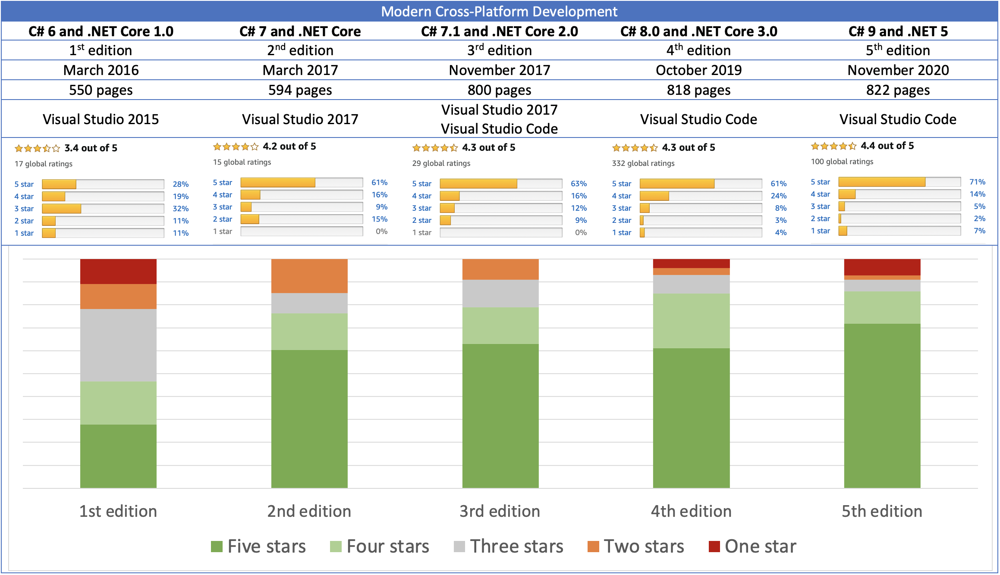

# Five Years of Ratings

The first edition of my book was published in March 2016. This month is the fifth anniversary, and the current fifth edition just received its one hundredth global rating, so I thought now would be a good time for a retrospective of how readers rate the five editions published so far and how I have worked hard and responded to feedback to improve the book with each edition. 

## 1st edition

Most popular rating is three stars. Average 3.4 stars. I could see that there was a lot to do to improve the quality of the book and its reception in the market. 

## 2nd edition

Huge improvement compared to 1st edition. Majority of ratings are five stars. No one star ratings. 

## 3rd edition

Incremental improvement compared to 2nd edition, but it was published only seven months later. Majority of ratings are five stars. No one star ratings, fewer two-star ratings. 

## 4th edition

A disappointing dip in the number of five-star ratings, balanced by a bigger increase in four-star ratings. Reappearance of some one-star ratings. This was the edition that I stopped using Visual Studio and switched to using Visual Studio Code as much as possible. Some readers were not happy. 

## 5th edition

Nice jump in five-star ratings to over 70%. But another small increase in one-star ratings. My embrace of modern cross-platform tools like Visual Studio Code is polarizing for readers. A super-majority love it; but a small minority hate it. geekette, a five-star reviewer from Australia, said, “He makes you use VS Code (not Visual Studio) which doesn't do as much for you but I found that useful as I now understand more.”

## 6th edition (coming November 2021)

Regardless of the benefits of Visual Studio Code, I do not want any reader to feel that I make them use a specific coding tool, so I am making some changes in the sixth edition that I hope will please readers who want to use Visual Studio or other coding tools to complete the coding tasks in the book. Plus there will be improvements throughout the book, expanded coverage of data management APIs, and a whole new chapter about .NET MAUI (Multi-platform App User Interface) for building cross-platform apps for mobile and desktop.

## Link to live ratings

If you want to see the latest ratings for all my book editions, the best place to start is my Amazon author page: https://www.amazon.com/Mark-J-Price/e/B071DW3QGN/ 
